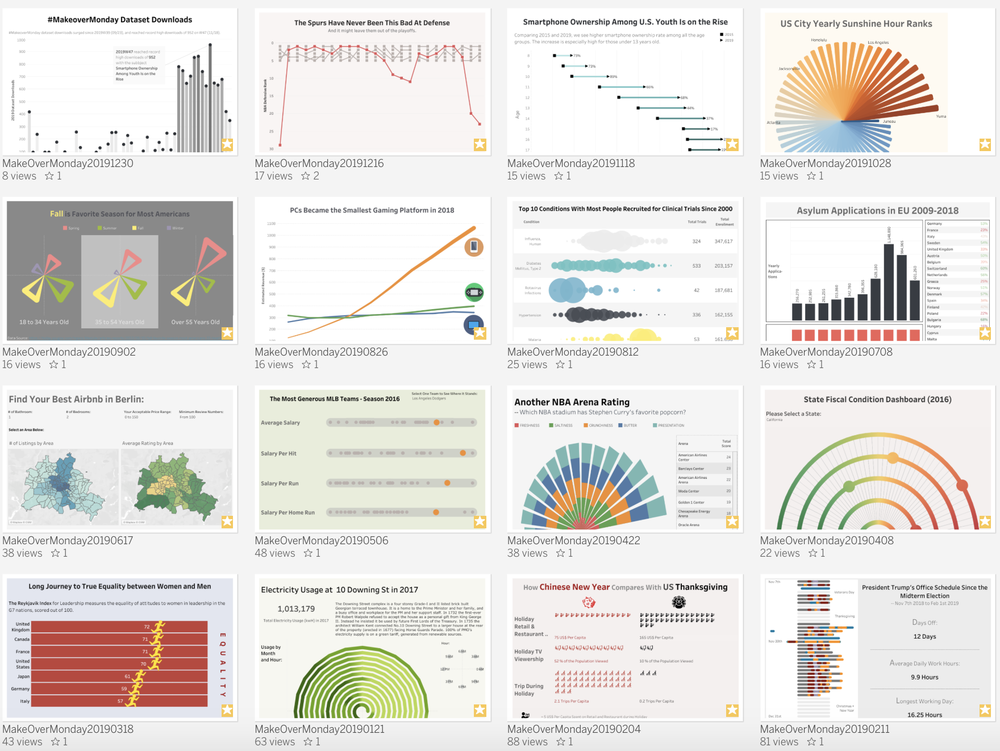
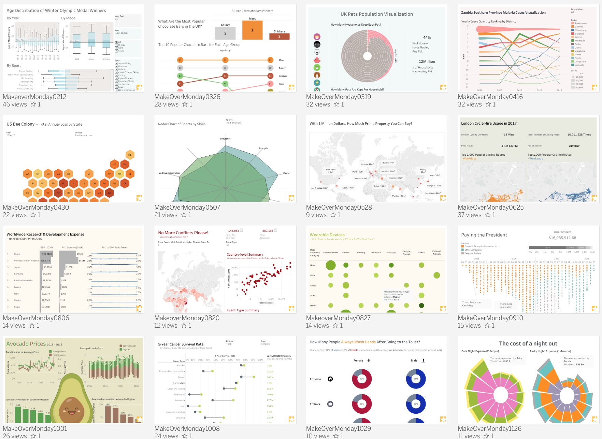

<head>
 <!-- Global site tag (gtag.js) - Google Analytics -->

</head>

## My Projects

### Data Science Projects
1. Fraud Detection Machine Learning Algorithms
 - [Unsupervised Fraud Detection Project](https://github.com/yudong-94/Unsupervised-Fraud-Detection-Algorithm)
 - [Realtime Unsupervised Fraud Detection Project](https://github.com/yudong-94/Realtime-Unsupervised-Fraud-Detection-Algorithm)
 - [Supervised Fraud Detection Project](https://github.com/yudong-94/Supervised-Fraud-Detection-Algorithm)
2. Kaggle Competitions
 - [Instacart Market Basket Analysis](https://github.com/yudong-94/Kaggle-Instacart-Market-Basket-Analysis)
 - [Porto Seguro’s Safe Driver Prediction](https://github.com/yudong-94/Kaggle-Safe-Driver-Prediction)

### Data Mining Projects
1. [City of LA 311 Call Center Data Analysis](https://github.com/yudong-94/City-of-LA-311-Call-Center-Data-Analysis)
2. [Movie Recommender System](https://github.com/yudong-94/My-Movie-Recommender)

### Data Visualization Projects

#### \#MakeoverMonday

[MakeoverMonday](http://www.makeovermonday.co.uk/) is a social data project:
"Each week we post a link to a chart, and its data, and then you rework the chart.
Maybe you retell the story more effectively, or find a new story in the data.
We’re curious to see the different approaches you all take. Whether it’s a simple bar chart or an elaborate infographic, we encourage everyone of all skills to partake.
Together we can have broader conversations about and with data."

Starting from Jan 08, 2018, I decide to put aside one hour on Monday weekly to create some visualization and find some insights from the data.

The datasets are published each week at: [MakeoverMonday Datasets](http://www.makeovermonday.co.uk/data/).  

**My 2020 MakeoverMonday Vizzes (Ongoing)**  
(you can also find them in [my Tableau Gallery](https://public.tableau.com/profile/yu.dong#!/))  
  

<table>
<thead style="display:block;width:100%;">
<tr style="display:block;">
<th align="left" width="5%">Week</th>
<th width="15%">Date</th>
<th width="50%">Topic</th>
<th align="left" width="30%">Data Source</th>
</tr>
</thead>
<tbody style="display:block;height:500px;overflow:auto;width:100%;">
<tr>
<td align="left">121</td>
<td>20200420</td>
<td><a href="https://yudong-94.github.io/personal-website/projects/data%20viz/MakeOverMonday20200420">Focus on what you eat, not whether your food is local</a></td>
<td align="left"><a href="https://ourworldindata.org/uploads/2020/02/GHG-emissions-by-life-cycle-stage-OurWorldinData-upload.csv">GHG Emissions by Lifecycle stage</a></td>
</tr>
<tr>
<td align="left">120</td>
<td>20200413</td>
<td><a href="https://yudong-94.github.io/personal-website/projects/data%20viz/MakeOverMonday20200413">Messi Vs Ronaldo Stats</a></td>
<td align="left"><a href="http://www.transfermarkt.com/">www.transfermarkt.com</a></td>
</tr>
<tr>
<td align="left">119</td>
<td>20200406</td>
<td><a href="https://yudong-94.github.io/personal-website/projects/data%20viz/MakeOverMonday20200406">Unpaid work: Allocation of time and time-use</a></td>
<td align="left"><a href="https://unstats.un.org/unsd/gender/timeuse/index.html">UN Stats</a></td>
</tr>
<tr>
<td align="left">118</td>
<td>20200330</td>
<td><a href="https://yudong-94.github.io/personal-website/projects/data%20viz/MakeOverMonday20200330">Does pineapple belong on a pizza?</a></td>
<td align="left"><a href="https://d25d2506sfb94s.cloudfront.net/cumulus_uploads/document/7ordz029w2/InternalResults_170228_Pizza_W.pdf">YouGov</a></td>
</tr>
<tr>
<td align="left">117</td>
<td>20200323</td>
<td><a href="https://yudong-94.github.io/personal-website/projects/data%20viz/MakeOverMonday20200323">Courses in Berkeley 1900-2011</a></td>
<td align="left"><a href="https://berkeley.app.box.com/v/CoursesBerkeley">UC ClioMetric History Project</a></td>
</tr>
<tr>
<td align="left">116</td>
<td>20200316</td>
<td><a href="https://yudong-94.github.io/personal-website/projects/data%20viz/MakeOverMonday20200316">Happiness and Life Satisfaction</a></td>
<td align="left"><a href="https://datacatalog.worldbank.org/dataset/world-development-indicators">World Bank</a></td>
</tr>
<tr>
<td align="left">115</td>
<td>20200309</td>
<td><a href="https://yudong-94.github.io/personal-website/projects/data%20viz/MakeOverMonday20200309">Violence Against Women & Girls – perceptions in African, Asian and South American countries</a></td>
<td align="left"><a href="https://dhsprogram.com/What-We-Do/Survey-Types/DHS.cfm">Demographic and Health Survey | Statcompiler</a></td>
</tr>
<tr>
<td align="left">114</td>
<td>20200302</td>
<td><a href="https://yudong-94.github.io/personal-website/projects/data%20viz/MakeOverMonday20200302">Costing Kids Sleep</a></td>
<td align="left"><a href="https://savvysleeper.org/costing-kids-sleep/">Costing Kids Sleep</a></td>
</tr>
<tr>
<td align="left">113</td>
<td>20200224</td>
<td><a href="https://yudong-94.github.io/personal-website/projects/data%20viz/MakeOverMonday20200224">Housing outcomes for clients of Australian Specialist Homelessness Services</a></td>
<td align="left"><a href="https://www.aihw.gov.au/reports/homelessness-services/specialist-homelessness-services-2017-18/data">AIHW Specialist homelessness services annual report 2017–18</a></td>
</tr>
<tr>
<td align="left">112</td>
<td>20200217</td>
<td><a href="https://yudong-94.github.io/personal-website/projects/data%20viz/MakeOverMonday20200217">All the World’s Wealth in One Visual</a></td>
<td align="left"><a href="https://www.credit-suisse.com/about-us/en/reports-research/global-wealth-report.html">Credit Suisse</a></td>
</tr>
<tr>
<td align="left">111</td>
<td>20200210</td>
<td><a href="https://yudong-94.github.io/personal-website/projects/data%20viz/MakeOverMonday20200210">Nearly a quarter of Americans have never experienced the U.S. in a time of peace</a></td>
<td align="left"><a href="https://www.washingtonpost.com/politics/2020/01/08/nearly-quarter-americans-have-never-experienced-us-time-peace/">Washington Post</a></td>
</tr>
<tr>
<td align="left">110</td>
<td>20200203</td>
<td><a href="https://yudong-94.github.io/personal-website/projects/data%20viz/MakeOverMonday20200203">Brexit James Bond</a></td>
<td align="left"><a href="https://d25d2506sfb94s.cloudfront.net/cumulus_uploads/document/sur4dbksy5/Bond_180925_ResultsWithCode.pdf">YouGov</a></td>
</tr>
<tr>
<td align="left">109</td>
<td>20200127</td>
<td><a href="https://yudong-94.github.io/personal-website/projects/data%20viz/MakeOverMonday20200127">Bridges to Prosperity</a></td>
<td align="left"><a href="https://bridges.app.box.com/s/pdvbowjrsakl6t2mmx0zpnzm1f1tzzu2">Bridges to Prosperity</a></td>
</tr>
<tr>
<td align="left">108</td>
<td>20200120</td>
<td><a href="https://yudong-94.github.io/personal-website/projects/data%20viz/MakeOverMonday20200120">Is it time to treat sugar like smoking?</a></td>
<td align="left"><a href="https://www.nutrition.org.uk/nutritioninthenews/new-reports/ndnsyears7and8.html">The British Nutrition Foundation</a></td>
</tr>
<tr>
<td align="left">107</td>
<td>20200113</td>
<td><a href="https://yudong-94.github.io/personal-website/projects/data%20viz/MakeOverMonday20200113">The USA lags behind other agricultural nations in banning harmful pesticides</a></td>
<td align="left"><a href="https://ehjournal.biomedcentral.com/articles/10.1186/s12940-019-0488-0">Environmental Health</a></td>
</tr>
<tr>
<td align="left">106</td>
<td>20200106</td>
<td><a href="https://yudong-94.github.io/personal-website/projects/data%20viz/MakeOverMonday20200106">What is America’s most popular sport?</a></td>
<td align="left"><a href="https://news.gallup.com/poll/4735/sports.aspx#1">Gallup</a></td>
</tr>
</tbody>
</table>

  
  
**My 2019 MakeoverMonday Vizzes (Completed)**  
(you can also find them in [my Tableau Gallery](https://public.tableau.com/profile/yu.dong#!/))  

<table>
<thead style="display:block;width:100%;">
<tr style="display:block;">
<th align="left" width="5%">Week</th>
<th width="15%">Date</th>
<th width="50%">Topic</th>
<th align="left" width="30%">Data Source</th>
</tr>
</thead>
<tbody style="display:block;height:500px;overflow:auto;width:100%;">
<tr>
<td align="left">105</td>
<td>20191230</td>
<td><a href="https://yudong-94.github.io/personal-website/projects/data%20viz/MakeOverMonday20191230">The Most Popular Makeover Monday Topics</a></td>
<td align="left"><a href="https://data.world/makeovermonday/2019w53">data.world</a></td>
</tr>
<tr>
<td align="left">104</td>
<td>20191223</td>
<td><a href="https://yudong-94.github.io/personal-website/projects/data%20viz/MakeOverMonday20191223">Estimated Christmas spending by concept</a></td>
<td align="left"><a href="https://www2.deloitte.com/uk/en/pages/consumer-business/articles/deloitte-christmas-survey-2019.html">Deloitte Christmas Survey 2019</a></td>
</tr>
<tr>
<td align="left">103</td>
<td>20191216</td>
<td><a href="https://yudong-94.github.io/personal-website/projects/data%20viz/MakeOverMonday20191216">The Spurs Have Never Been This Bad At Defense – NBA Defensive Ratings</a></td>
<td align="left"><a href="https://stats.nba.com/teams/defense/?sort=DEF_RATING&dir=-1&Season=2019-20&SeasonType=Regular%20Season">NBA</a></td>
</tr>
<tr>
<td align="left">102</td>
<td>20191209</td>
<td><a href="https://yudong-94.github.io/personal-website/projects/data%20viz/MakeOverMonday20191209">Ranked: Biggest Fast Food Chains in America</a></td>
<td align="left"><a href="https://www.visualcapitalist.com/biggest-fast-food-chains-in-america/">Visual Capitalist</a></td>
</tr>
<tr>
<td align="left">101</td>
<td>20191202</td>
<td><a href="https://yudong-94.github.io/personal-website/projects/data%20viz/MakeOverMonday20191202">How much does union membership benefit America’s workers?</a></td>
<td align="left"><a href="https://www.bls.gov/webapps/legacy/cpslutab2.htm">Bureau of Labor Statistics</a></td>
</tr>
<tr>
<td align="left">100</td>
<td>20191125</td>
<td><a href="https://yudong-94.github.io/personal-website/projects/data%20viz/MakeOverMonday20191125">2018 Central Park Squirrel Census Fur Map</a></td>
<td align="left"><a href="https://data.cityofnewyork.us/Environment/2018-Central-Park-Squirrel-Census-Squirrel-Data/vfnx-vebw">NYC Open Data</a></td>
</tr>
<tr>
<td align="left">99</td>
<td>20191118</td>
<td><a href="https://yudong-94.github.io/personal-website/projects/data%20viz/MakeOverMonday20191118">Smartphone Ownership Among Youth Is on the Rise</a></td>
<td align="left"><a href="https://www.commonsensemedia.org/sites/default/files/uploads/research/2019-census-8-to-18-full-report-updated.pdf">Common Sense (page 27)</a></td>
</tr>
<tr>
<td align="left">98</td>
<td>20191111</td>
<td><a href="https://yudong-94.github.io/personal-website/projects/data%20viz/MakeOverMonday20191111">Youth and Adult Literacy Rates</a></td>
<td align="left"><a href="http://data.uis.unesco.org/index.aspx?queryid=3482">UNESCO SDG4</a></td>
</tr>
<tr>
<td align="left">97</td>
<td>20191104</td>
<td><a href="https://yudong-94.github.io/personal-website/projects/data%20viz/MakeOverMonday20191104">Las Vegas Convention Attendance & Visitor Traffic: Jan 1970-Oct 2019</a></td>
<td align="left"><a href="https://www.lvcva.com/stats-and-facts/visitor-statistics/">Las Vegas Convention and Visitors Authority</a></td>
</tr>
<tr>
<td align="left">96</td>
<td>20191028</td>
<td><a href="https://yudong-94.github.io/personal-website/projects/data%20viz/MakeOverMonday20191028">World Cities Ranked by Average Annual Sunshine Hours</a></td>
<td align="left"><a href="https://en.m.wikipedia.org/wiki/List_of_cities_by_sunshine_duration">Wikipedia</a></td>
</tr>
<tr>
<td align="left">95</td>
<td>20191021</td>
<td><a href="https://yudong-94.github.io/personal-website/projects/data%20viz/MakeOverMonday20191021">The age at which most people are dying by suicide</a></td>
<td align="left"><a href="https://data.world/makeovermonday/2019w43">Office for National Statistics</a></td>
</tr>
<tr>
<td align="left">94</td>
<td>20191014</td>
<td><a href="https://yudong-94.github.io/personal-website/projects/data%20viz/MakeOverMonday20191014">Ironman World Championship Medalists</a></td>
<td align="left"><a href="https://en.wikipedia.org/wiki/Ironman_World_Championship">Wikipedia</a></td>
</tr>
<tr>
<td align="left">93</td>
<td>20191007</td>
<td><a href="https://yudong-94.github.io/personal-website/projects/data%20viz/MakeOverMonday20191007">Donations accepted by political parties</a></td>
<td align="left"><a href="http://search.electoralcommission.org.uk/?currentPage=1&rows=10&sort=AcceptedDate&order=desc&tab=1&et=pp&et=ppm&et=tp&et=perpar&et=rd&isIrishSourceYes=true&isIrishSourceNo=true&prePoll=false&postPoll=true&register=gb&register=ni&register=none&optCols=Register&optCols=CampaigningName&optCols=AccountingUnitsAsCentralParty&optCols=IsSponsorship&optCols=IsIrishSource&optCols=RegulatedDoneeType&optCols=CompanyRegistrationNumber&optCols=Postcode&optCols=NatureOfDonation&optCols=PurposeOfVisit&optCols=DonationAction&optCols=ReportedDate&optCols=IsReportedPrePoll&optCols=ReportingPeriodName&optCols=IsBequest&optCols=IsAggregation">The Electoral Commission</a></td>
</tr>
<tr>
<td align="left">92</td>
<td>20190930</td>
<td><a href="https://yudong-94.github.io/personal-website/projects/data%20viz/MakeOverMonday20190930">London Population Predictions</a></td>
<td align="left"><a href="https://data.london.gov.uk/download/projections/fcda413b-2b3a-44cd-a692-242bc45ffe24/central_trend_2017_base.xlsx">London Datastore</a></td>
</tr>
<tr>
<td align="left">91</td>
<td>20190923</td>
<td><a href="https://yudong-94.github.io/personal-website/projects/data%20viz/MakeOverMonday20190923">Evictions in San Francisco</a></td>
<td align="left"><a href="https://data.sfgov.org/Housing-and-Buildings/Eviction-Notices/5cei-gny5">DataSF</a></td>
</tr>
<tr>
<td align="left">90</td>
<td>20190916</td>
<td><a href="https://yudong-94.github.io/personal-website/projects/data%20viz/MakeOverMonday20190916">Positive Impact Events – Committments from the Event Industry for the Sustainable Development Goals</a></td>
<td align="left"><a href="https://events.myworld2030.org/">MyWorld2030 Events Survey</a></td>
</tr>
<tr>
<td align="left">89</td>
<td>20190909</td>
<td><a href="https://yudong-94.github.io/personal-website/projects/data%20viz/MakeOverMonday20190909">James Patterson Book Checkouts at Seattle Libraries</a></td>
<td align="left"><a href="https://data.seattle.gov/Community/Checkouts-by-Title/tmmm-ytt6/data">Seattle Open Data</a></td>
</tr>
<tr>
<td align="left">88</td>
<td>20190902</td>
<td><a href="https://yudong-94.github.io/personal-website/projects/data%20viz/MakeOverMonday20190902">Fall is favorite season for most Americans</a></td>
<td align="left"><a href="https://today.yougov.com/topics/lifestyle/articles-reports/2013/06/10/fall-favorite-season-most-americans-33-heartland-l">YouGov</a></td>
</tr>
<tr>
<td align="left">87</td>
<td>20190826</td>
<td><a href="https://yudong-94.github.io/personal-website/projects/data%20viz/MakeOverMonday20190826">PCs to Become the Smallest Gaming Platform in 2018</a></td>
<td align="left"><a href="https://www.statista.com/chart/13789/worldwide-video-game-revenue-forecast/">Statista</a></td>
</tr>
<tr>
<td align="left">86</td>
<td>20190819</td>
<td><a href="https://yudong-94.github.io/personal-website/projects/data%20viz/MakeOverMonday20190819">Americans touch their smartphones 2,617 times a day</a></td>
<td align="left"><a href="https://www.pewinternet.org/2018/08/22/how-teens-and-parents-navigate-screen-time-and-device-distractions/pi_2018-08-22_teens-screentime_0-01/">Pew Research Center</a></td>
</tr>
<tr>
<td align="left">85</td>
<td>20190812</td>
<td><a href="https://yudong-94.github.io/personal-website/projects/data%20viz/MakeOverMonday20190812">A bird’s-eye view of clinical trials</a></td>
<td align="left"><a href="https://www.aerodatalab.org/birds-eye-view-of-research-landscape">Aero Data Lab</a></td>
</tr>
<tr>
<td align="left">84</td>
<td>20190805</td>
<td><a href="https://yudong-94.github.io/personal-website/projects/data%20viz/MakeOverMonday20190805">The power switch: tracking Britain’s record coal-free run</a></td>
<td align="left"><a href="https://www.gridwatch.templar.co.uk/download.php">Gridwatch</a></td>
</tr>
<tr>
<td align="left">83</td>
<td>20190729</td>
<td><a href="https://yudong-94.github.io/personal-website/projects/data%20viz/MakeOverMonday20190729">STD Infections Rates in America</a></td>
<td align="left"><a href="https://wonder.cdc.gov/controller/datarequest/D128">CDC</a></td>
</tr>
<tr>
<td align="left">82</td>
<td>20190722</td>
<td><a href="https://yudong-94.github.io/personal-website/projects/data%20viz/MakeOverMonday20190722">Arsenal FC’s 2018/19 season</a></td>
<td align="left"><a href="https://www.premierleague.com/stats/top/players/goals">Premier League Stat Center</a></td>
</tr>
<tr>
<td align="left">81</td>
<td>20190715</td>
<td><a href="https://yudong-94.github.io/personal-website/projects/data%20viz/MakeOverMonday20190715">The share of Americans not having sex has reached a record high</a></td>
<td align="left"><a href="https://gssdataexplorer.norc.org/variables/5057/vshow">General Social Survey</a></td>
</tr>
<tr>
<td align="left">80</td>
<td>20190708</td>
<td><a href="https://yudong-94.github.io/personal-website/projects/data%20viz/MakeOverMonday20190708">Asylum Applications in EU</a></td>
<td align="left"><a href="http://appsso.eurostat.ec.europa.eu/nui/show.do?dataset=migr_asyappctza&lang=en">Eurostsat</a></td>
</tr>
<tr>
<td align="left">79</td>
<td>20190701</td>
<td><a href="https://yudong-94.github.io/personal-website/projects/data%20viz/MakeOverMonday20190701">Game of Thrones Deaths</a></td>
<td align="left"><a href="https://data.world/datasaurusrex/game-of-thones-deaths">David Murphy</a></td>
</tr>
<tr>
<td align="left">78</td>
<td>20190624</td>
<td><a href="https://yudong-94.github.io/personal-website/projects/data%20viz/MakeOverMonday20190624">Alcohol Consumption By Country</a></td>
<td align="left"><a href="https://www.worldatlas.com/articles/who-drinks-the-most-alcohol-consumption-by-country.html">World Atlas</a></td>
</tr>
<tr>
<td align="left">77</td>
<td>20190617</td>
<td><a href="https://yudong-94.github.io/personal-website/projects/data%20viz/MakeOverMonday20190617">Berlin Airbnb Ratings</a></td>
<td align="left"><a href="http://insideairbnb.com/get-the-data.html" rel="nofollow">Inside Airbnb</a></td>
</tr>
<tr>
<td align="left">76</td>
<td>20190610</td>
<td><a href="https://yudong-94.github.io/personal-website/projects/data%20viz/MakeOverMonday20190610">Is it wrong for same-sex couples to have sexual relations?</a></td>
<td align="left"><a href="https://gssdataexplorer.norc.org/trends/Gender%20&%20Marriage?measure=homosex" rel="nofollow">GSS Data Explorer</a></td>
</tr>
<tr>
<td align="left">75</td>
<td>20190603</td>
<td><a href="https://yudong-94.github.io/personal-website/projects/data%20viz/MakeOverMonday20190603">Sleepless in America?</a></td>
<td align="left"><a href="https://www.bls.gov/tus/database.htm" rel="nofollow">American Time Use Survey</a></td>
</tr>
<tr>
<td align="left">74</td>
<td>20190527</td>
<td><a href="https://yudong-94.github.io/personal-website/projects/data%20viz/MakeOverMonday20190527">CO2 emissions per capita</a></td>
<td align="left"><a href="http://api.worldbank.org/v2/en/indicator/EN.ATM.CO2E.PC?downloadformat=csv" rel="nofollow">World Bank</a></td>
</tr>
<tr>
<td align="left">73</td>
<td>20190520</td>
<td><a href="https://yudong-94.github.io/personal-website/projects/data%20viz/MakeOverMonday20190520">North American Bear Attacks</a></td>
<td align="left"><a href="https://en.wikipedia.org/wiki/List_of_fatal_bear_attacks_in_North_America" rel="nofollow">Wikipedia</a></td>
</tr>
<tr>
<td align="left">72</td>
<td>20190513</td>
<td><a href="https://yudong-94.github.io/personal-website/projects/data%20viz/MakeOverMonday20190513">Rhino Poaching in South Africa</a></td>
<td align="left"><a href="http://www.poachingfacts.com/poaching-statistics/rhino-poaching-statistics/" rel="nofollow">Department of Environmental Affairs</a></td>
</tr>
<tr>
<td align="left">71</td>
<td>20190506</td>
<td><a href="https://yudong-94.github.io/personal-website/projects/data%20viz/MakeOverMonday20190506">Major League Baseball Most Efficient Batters</a></td>
<td align="left"><a href="http://www.seanlahman.com/baseball-archive/statistics" rel="nofollow">Lahman’s Baseball Database</a></td>
</tr>
<tr>
<td align="left">70</td>
<td>20190429</td>
<td><a href="https://yudong-94.github.io/personal-website/projects/data%20viz/MakeOverMonday20190429">ISS Spacewalks</a></td>
<td align="left"><a href="https://www.nasa.gov/mission_pages/station/spacewalks/" rel="nofollow">NASA</a></td>
</tr>
<tr>
<td align="left">69</td>
<td>20190422</td>
<td><a href="https://yudong-94.github.io/personal-website/projects/data%20viz/MakeOverMonday20190422">Steph Curry’s Stadium Popcorn Rankings</a></td>
<td align="left"><a href="https://twitter.com/StephenCurry30" rel="nofollow">Stephen Curry</a></td>
</tr>
<tr>
<td align="left">68</td>
<td>20190415</td>
<td><a href="https://yudong-94.github.io/personal-website/projects/data%20viz/MakeOverMonday20190415">The words in ‘Info We Trust’</a></td>
<td align="left"><a href="https://infowetrust.com/inspire/" rel="nofollow">RJ Andrews (Author)</a></td>
</tr>
<tr>
<td align="left">67</td>
<td>20190408</td>
<td><a href="https://yudong-94.github.io/personal-website/projects/data%20viz/MakeOverMonday20190408">Ranking the States by Fiscal Condition</a></td>
<td align="left"><a href="https://www.mercatus.org/statefiscalrankings" rel="nofollow">Mercatus Center</a></td>
</tr>
<tr>
<td align="left">66</td>
<td>20190401</td>
<td><a href="https://yudong-94.github.io/personal-website/projects/data%20viz/MakeOverMonday20190401">Wastes on UK Beaches</a></td>
<td align="left"><a href="https://www.mcsuk.org/media/GBBC_2017_Report.pdf" rel="nofollow">Great British Beach Clean Report 2017</a></td>
</tr>
<tr>
<td align="left">65</td>
<td>20190325</td>
<td><a href="https://yudong-94.github.io/personal-website/projects/data%20viz/MakeOverMonday20190325">Consumer Spending by Generation</a></td>
<td align="left"><a href="https://finance.yahoo.com/news/chart-reveals-huge-difference-millennials-201133732.html" rel="nofollow">Bank of America Merrill Lynch</a></td>
</tr>
<tr>
<td align="left">64</td>
<td>20190318</td>
<td><a href="https://yudong-94.github.io/personal-website/projects/data%20viz/MakeOverMonday20190318">How do we really feel about women leaders?</a></td>
<td align="left"><a href="https://www2.kantar.com/l/208642/2018-11-23/823bj/208642/80069/The_Reykjavik_Index_for_Leadership_Report_DIGITAL.pdf" rel="nofollow">The Reykjavik Index for Leadership</a></td>
</tr>
<tr>
<td align="left">63</td>
<td>20190311</td>
<td><a href="https://yudong-94.github.io/personal-website/projects/data%20viz/MakeOverMonday20190311">Philadelphia Real Estate Transfers</a></td>
<td align="left"><a href="https://www.opendataphilly.org/" rel="nofollow">OpenDataPhilly</a></td>
</tr>
<tr>
<td align="left">62</td>
<td>20190304</td>
<td><a href="https://yudong-94.github.io/personal-website/projects/data%20viz/MakeOverMonday20190304">World Development Indicators – Health and Equality</a></td>
<td align="left"><a href="https://datacatalog.worldbank.org/dataset/world-development-indicators" rel="nofollow">World Bank</a></td>
</tr>
<tr>
<td align="left">61</td>
<td>20190225</td>
<td><a href="https://yudong-94.github.io/personal-website/projects/data%20viz/MakeOverMonday20190225">Economic value of the bicycle industry</a></td>
<td align="left"><a href="http://www.sqw.co.uk/" rel="nofollow">SQW</a></td>
</tr>
<tr>
<td align="left">60</td>
<td>20190218</td>
<td><a href="https://yudong-94.github.io/personal-website/projects/data%20viz/MakeOverMonday20190218">Which States Produce the Most Wind Energy</a></td>
<td align="left"><a href="https://www.chooseenergy.com/news/article/best-worst-ranked-states-wind-power/" rel="nofollow">American Wind Energy Association via Choose Engery</a></td>
</tr>
<tr>
<td align="left">59</td>
<td>20190211</td>
<td><a href="https://yudong-94.github.io/personal-website/projects/data%20viz/MakeOverMonday20190211">Trump’s “Executive Time”</a></td>
<td align="left"><a href="https://www.axios.com/donald-trump-private-schedules-leak-executive-time-34e67fbb-3af6-48df-aefb-52e02c334255.html" rel="nofollow">Axios</a></td>
</tr>
<tr>
<td align="left">58</td>
<td>20190204</td>
<td><a href="https://yudong-94.github.io/personal-website/projects/data%20viz/MakeOverMonday20190204">How Chinese New Year Compares With Thanksgiving</a></td>
<td align="left"><a href="https://www.statista.com/chart/3246/how-chinese-new-year-compares-with-thanksgiving/" rel="nofollow">Bloomberg via Statista</a></td>
</tr>
<tr>
<td align="left">57</td>
<td>20190128</td>
<td><a href="https://yudong-94.github.io/personal-website/projects/data%20viz/MakeOverMonday20190128">Digital Economy and Society Index (DESI)</a></td>
<td align="left"><a href="https://digital-agenda-data.eu/charts/desi-components" rel="nofollow">European Commission</a></td>
</tr>
<tr>
<td align="left">56</td>
<td>20190121</td>
<td><a href="https://yudong-94.github.io/personal-website/projects/data%20viz/MakeOverMonday20190121">Energy Use at 10 Downing Street</a></td>
<td align="left"><a href="https://platform.carbonculture.net/apps/studydata/data-download?year=2018&id=9&subject=places" rel="nofollow">CarbonCulture</a></td>
</tr>
<tr>
<td align="left">55</td>
<td>20190114</td>
<td><a href="https://yudong-94.github.io/personal-website/projects/data%20viz/MakeOverMonday20190114">How many people earned the Federal minimum wage or less in each State?</a></td>
<td align="left"><a href="https://www.bls.gov/opub/reports/minimum-wage/2017/home.htm" rel="nofollow">Bureau of Labor Statistics</a></td>
</tr>
<tr>
<td align="left">54</td>
<td>20190107</td>
<td><a href="https://yudong-94.github.io/personal-website/projects/data%20viz/MakeOverMonday20190107">Press Freedom’s Dark Horizon</a></td>
<td align="left"><a href="https://freedomhouse.org/sites/default/files/FOTP1980-FOTP2017_Public-Data.xlsx" rel="nofollow">Freedomhouse.org</a></td>
</tr>
</tbody>
</table>

My best vizzes in 2019:  
  

**My 2018 MakeoverMonday Vizzes (Completed)**  
(you can also find them in [my Tableau Gallery](https://public.tableau.com/profile/yu.dong#!/))  

<table>
<thead style="display:block;width:100%;">
<tr style="display:block;">
<th align="left" width="3%">Week</th>
<th width="20%">Date</th>
<th width="40%">Topic</th>
<th align="left" width="37%">Data Source</th>
</tr>
</thead>
<tbody style="display:block;height:500px;overflow:auto;width:100%;">
<tr>
<td align="left">53</td>
<td>20181231</td>
<td><a href="https://yudong-94.github.io/personal-website/projects/data%20viz/MakeOverMonday20181231">NHL Attendance</a></td>
<td align="left"><a href="http://www.espn.com/nhl/attendance/_/year/2018" rel="nofollow">ESPN</a></td>
</tr>
<tr>
<td align="left">52</td>
<td>20181227(make up 20180101)</td>
<td><a href="https://yudong-94.github.io/personal-website/projects/data%20viz/MakeOverMonday20181227">U.S. Per Capita Consumption of Poultry and Livestock</a></td>
<td align="left"><a href="http://www.nationalchickencouncil.org/about-the-industry/statistics/per-capita-consumption-of-poultry-and-livestock-1965-to-estimated-2012-in-pounds/" rel="nofollow">National Chicken Council</a></td>
</tr>
<tr>
<td align="left">51</td>
<td>20181224</td>
<td><a href="https://yudong-94.github.io/personal-website/projects/data%20viz/MakeOverMonday20181224">Average spending on Christmas gifts in the U.S. 1999-2018</a></td>
<td align="left"><a href="https://www.statista.com/statistics/246963/christmas-spending-in-the-us-during-november/" rel="nofollow">Statista</a></td>
</tr>
<tr>
<td align="left">50</td>
<td>20181217</td>
<td><a href="https://yudong-94.github.io/personal-website/projects/data%20viz/MakeOverMonday20181217">London Bus Safety Performance</a></td>
<td align="left"><a href="https://tfl.gov.uk/corporate/publications-and-reports/bus-safety-data" rel="nofollow">TFL</a></td>
</tr>
<tr>
<td align="left">49</td>
<td>20181210</td>
<td><a href="https://yudong-94.github.io/personal-website/projects/data%20viz/MakeOverMonday20181210">Land Use by Food Type</a></td>
<td align="left"><a href="https://ourworldindata.org/grapher/land-use-per-gram-of-protein-by-food-type" rel="nofollow">Our World in Data</a></td>
</tr>
<tr>
<td align="left">48</td>
<td>20181203</td>
<td><a href="https://yudong-94.github.io/personal-website/projects/data%20viz/MakeOverMonday20181203">Women Constructors in the Shortz Era</a></td>
<td align="left"><a href="https://www.xwordinfo.com/" rel="nofollow">XWord Info</a></td>
</tr>
<tr>
<td align="left">47</td>
<td>20181126</td>
<td><a href="https://yudong-94.github.io/personal-website/projects/data%20viz/MakeOverMonday20181126">The Cost of A Night Out</a></td>
<td align="left"><a href="https://www.ubs.com/microsites/prices-earnings/en/stories/7-dinner-in-paris-party-in-miami-the-cheapest-and-priciest-cities-for-a-night-out/" rel="nofollow">UBS</a></td>
</tr>
<tr>
<td align="left">46</td>
<td>20181119</td>
<td><a href="https://yudong-94.github.io/personal-website/projects/data%20viz/MakeOverMonday20181119">How Many Hours Americans Need to Work to Pay Their Mortgage</a></td>
<td align="left"><a href="https://howmuch.net/sources/hours-work-afford-home" rel="nofollow">howmuch.net</a></td>
</tr>
<tr>
<td align="left">45</td>
<td>20181112</td>
<td><a href="https://yudong-94.github.io/personal-website/projects/data%20viz/MakeOverMonday20181112">Diversity in Tech</a></td>
<td align="left"><a href="https://docs.google.com/spreadsheets/d/1e5jevLJTK9Aayob2msk4Ss9qIMCqfris4m_m0kXO-7s/edit#gid=65558231" rel="nofollow">Company and Press Reports</a></td>
</tr>
<tr>
<td align="left">44</td>
<td>20181105</td>
<td><a href="https://yudong-94.github.io/personal-website/projects/data%20viz/MakeOverMonday20181105">US Population Projection by Age Group 2016-2060</a></td>
<td align="left"><a href="https://www.census.gov/data/datasets/2017/demo/popproj/2017-popproj.html" rel="nofollow">United States Census Bureau</a></td>
</tr>
<tr>
<td align="left">43</td>
<td>20181029</td>
<td><a href="https://yudong-94.github.io/personal-website/projects/data%20viz/MakeOverMonday20181029">Washing Hands After Going to the Toilet</a></td>
<td align="left"><a href="https://d25d2506sfb94s.cloudfront.net/cumulus_uploads/document/yifb4ww12p/YouGov%20washing%20hands.pdf" rel="nofollow">YouGov</a></td>
</tr>
<tr>
<td align="left">42</td>
<td>20181022</td>
<td><a href="https://yudong-94.github.io/personal-website/projects/data%20viz/MakeOverMonday20181022">Beer Cost at Every MLB Stadium</a></td>
<td align="left"><a href="https://www.teammarketing.com/" rel="nofollow">Team Marketing Report</a></td>
</tr>
<tr>
<td align="left">41</td>
<td>20181015</td>
<td><a href="https://yudong-94.github.io/personal-website/projects/data%20viz/MakeOverMonday20181015">Total Number of Women the House of Representatives: 1917-2018</a></td>
<td align="left"><a href="https://fas.org/sgp/crs/misc/RL30261.pdf" rel="nofollow">Congressional Research Service</a></td>
</tr>
<tr>
<td align="left">40</td>
<td>20181008</td>
<td><a href="https://yudong-94.github.io/personal-website/projects/data%20viz/MakeOverMonday20181008">5-Year Cancer Survival Rates in US</a></td>
<td align="left"><a href="https://ourworldindata.org/cancer#are-death-rates-from-cancer-rising" rel="nofollow">Our World in Data</a></td>
</tr>
<tr>
<td align="left">39</td>
<td>20181001</td>
<td><a href="https://yudong-94.github.io/personal-website/projects/data%20viz/MakeOverMonday20181001">Avocado Prices</a></td>
<td align="left"><a href="http://www.hassavocadoboard.com/retail/volume-and-price-data" rel="nofollow">Hass Avocado Board</a></td>
</tr>
<tr>
<td align="left">38</td>
<td>20180924</td>
<td><a href="https://yudong-94.github.io/personal-website/projects/data%20viz/MakeOverMonday20180924">Visualzing Equality</a></td>
<td align="left"><a href="http://data.em2030.org/wp-content/uploads/2018/09/EM2030-2018-Global-Report.pdf" rel="nofollow">EM 2030</a></td>
</tr>
<tr>
<td align="left">37</td>
<td>20180917</td>
<td><a href="https://yudong-94.github.io/personal-website/projects/data%20viz/MakeOverMonday20180917">Train Versus Plane in Europe</a></td>
<td align="left"><a href="https://github.com/dw-data/travel-cost">DW Data</a></td>
</tr>
<tr>
<td align="left">36</td>
<td>20180910</td>
<td><a href="https://yudong-94.github.io/personal-website/projects/data%20viz/MakeOverMonday20180910">Paying the President</a></td>
<td align="left"><a href="https://www.propublica.org/datastore/dataset/spending-at-trump-properties" rel="nofollow">ProPublica</a></td>
</tr>
<tr>
<td align="left">35</td>
<td>20180903</td>
<td><a href="https://yudong-94.github.io/personal-website/projects/data%20viz/MakeOverMonday20180903">Nike Factory Locations</a></td>
<td align="left"><a href="http://manufacturingmap.nikeinc.com/" rel="nofollow">Nike Inc.</a></td>
</tr>
<tr>
<td align="left">34</td>
<td>20180827</td>
<td><a href="https://yudong-94.github.io/personal-website/projects/data%20viz/MakeOverMonday20180827">Wearable Devices</a></td>
<td align="left"><a href="https://www.crowdflower.com/data-for-everyone/" rel="nofollow">Figure Eight</a></td>
</tr>
<tr>
<td align="left">33</td>
<td>20180820</td>
<td><a href="https://yudong-94.github.io/personal-website/projects/data%20viz/MakeOverMonday20180820">ACLED: Visualizing Conflict</a></td>
<td align="left"><a href="https://www.acleddata.com/data/" rel="nofollow">ACLED</a></td>
</tr>
<tr>
<td align="left">32</td>
<td>20180813</td>
<td><a href="https://yudong-94.github.io/personal-website/projects/data%20viz/MakeOverMonday20180813">Anthony Bourdain’s Travels</a></td>
<td align="left"><a href="https://twitter.com/christinezhang" rel="nofollow">@ChristineZhang</a></td>
</tr>
<tr>
<td align="left">31</td>
<td>20180806</td>
<td><a href="https://yudong-94.github.io/personal-website/projects/data%20viz/MakeOverMonday20180806">How Much Your Country Spends on Research &amp; Development</a></td>
<td align="left"><a href="http://data.uis.unesco.org/Index.aspx?DataSetCode=SCN_DS" rel="nofollow">UNESCO Institute for Statistics</a></td>
</tr>
<tr>
<td align="left">30</td>
<td>20180730</td>
<td><a href="https://yudong-94.github.io/personal-website/projects/data%20viz/MakeOverMonday20180730">Big Mac Index</a></td>
<td align="left"><a href="https://github.com/TheEconomist/big-mac-data/tree/master/output-data">The Economist</a></td>
</tr>
<tr>
<td align="left">29</td>
<td>20180723</td>
<td><a href="https://yudong-94.github.io/personal-website/projects/data%20viz/MakeOverMonday20180723">OECD Parental Leave System</a></td>
<td align="left"><a href="https://www.oecd.org/els/soc/PF2_1_Parental_leave_systems.pdf" rel="nofollow">OECD</a></td>
</tr>
<tr>
<td align="left">28</td>
<td>20180716</td>
<td><a href="https://yudong-94.github.io/personal-website/projects/data%20viz/MakeOverMonday20180716">Historical NBA Team Spending Against the Cap</a></td>
<td align="left"><a href="http://www.celticshub.com/2017/12/07/nba-player-salaries-1991-2017/" rel="nofollow">CeltsHub</a></td>
</tr>
<tr>
<td align="left">27</td>
<td>20180709</td>
<td><a href="https://yudong-94.github.io/personal-website/projects/data%20viz/MakeOverMonday20180709">Volcano Eruptions</a></td>
<td align="left"><a href="https://volcano.si.edu/list_volcano_holocene.cfm" rel="nofollow">Global Volcanism Program</a></td>
</tr>
<tr>
<td align="left">26</td>
<td>20180702</td>
<td><a href="https://yudong-94.github.io/personal-website/projects/data%20viz/MakeOverMonday20180702">Rat Sightings in NYC</a></td>
<td align="left"><a href="https://nycopendata.socrata.com/Social-Services/Rat-Sightings/3q43-55fe/data" rel="nofollow">NYC Open Data</a></td>
</tr>
<tr>
<td align="left">25</td>
<td>20180625</td>
<td><a href="https://yudong-94.github.io/personal-website/projects/data%20viz/MakeOverMonday20180625">London Cycle Hire Usage</a></td>
<td align="left"><a href="http://cycling.data.tfl.gov.uk/" rel="nofollow">Transport for London</a></td>
</tr>
<tr>
<td align="left">24</td>
<td>20180618</td>
<td><a href="https://yudong-94.github.io/personal-website/projects/data%20viz/MakeOverMonday20180618">U.S. Influenza Surveillance Report</a></td>
<td align="left"><a href="https://gis.cdc.gov/grasp/fluview/fluportaldashboard.html" rel="nofollow">CDC</a></td>
</tr>
<tr>
<td align="left">23</td>
<td>20180611</td>
<td><a href="https://yudong-94.github.io/personal-website/projects/data%20viz/MakeOverMonday20180611">Tourism Density Index</a></td>
<td align="left"><a href="https://intrepidgroup.bynder.com/transfer/bdd0abcac448329ed4c9057327b6ca660742e4b5ea16f18bd5a343b2c6d0d0c8" rel="nofollow">Intrepid Travel</a></td>
</tr>
<tr>
<td align="left">22</td>
<td>20180604</td>
<td><a href="https://yudong-94.github.io/personal-website/projects/data%20viz/MakeOverMonday20180604">UK Gender Gap</a></td>
<td align="left"><a href="https://www.gov.uk/report-gender-pay-gap-data" rel="nofollow">GOV.UK</a></td>
</tr>
<tr>
<td align="left">21</td>
<td>20180528</td>
<td><a href="https://yudong-94.github.io/personal-website/projects/data%20viz/MakeOverMonday20180528">The World’s Most Expensive Prime Property</a></td>
<td align="left"><a href="https://www.weforum.org/agenda/2018/04/chart-of-the-day-the-worlds-most-expensive-prime-property" rel="nofollow">WeForum</a></td>
</tr>
<tr>
<td align="left">20</td>
<td>20180521</td>
<td><a href="https://yudong-94.github.io/personal-website/projects/data%20viz/MakeOverMonday20180521">Premier League Rank Prediction Vesus Reality</a></td>
<td align="left"><a href="https://amp.theguardian.com/football/2018/may/15/premier-league-2017-18-season-predictions-versus-reality" rel="nofollow">The Guardian</a></td>
</tr>
<tr>
<td align="left">19</td>
<td>20180514</td>
<td><a href="https://yudong-94.github.io/personal-website/projects/data%20viz/MakeOverMonday20180514">Traffic Jam in Europe</a></td>
<td align="left"><a href="http://www.euronews.com/2018/02/07/which-european-commuters-spend-the-most-time-in-traffic-jams-" rel="nofollow">Euronews</a></td>
</tr>
<tr>
<td align="left">18</td>
<td>20180507</td>
<td><a href="https://yudong-94.github.io/personal-website/projects/data%20viz/MakeOverMonday20180507">Toughest Sport by Skill</a></td>
<td align="left"><a href="http://www.espn.com/espn/page2/sportSkills" rel="nofollow">ESPN</a></td>
</tr>
<tr>
<td align="left">17</td>
<td>20180430</td>
<td><a href="https://yudong-94.github.io/personal-website/projects/data%20viz/MakeOverMonday20180430">Bee Colony Loss in the US</a></td>
<td align="left"><a href="https://bip2.beeinformed.org/loss-map/" rel="nofollow">BeeInformed</a></td>
</tr>
<tr>
<td align="left">16</td>
<td>20180423</td>
<td><a href="https://yudong-94.github.io/personal-website/projects/data%20viz/MakeOverMonday20180423">Ecological Footprint per Capita</a></td>
<td align="left"><a href="https://data.world/footprint/nfa-2018-edition" rel="nofollow">Global Footprint Network</a></td>
</tr>
<tr>
<td align="left">15</td>
<td>20180416</td>
<td><a href="https://yudong-94.github.io/personal-website/projects/data%20viz/MakeOverMonday20180416">Zambia Southern Province Confirmed Malaria Cases</a></td>
<td align="left">Simulated data from <a href="http://visualizenomalaria.org" rel="nofollow">http://visualizenomalaria.org</a>, contact <a href="mailto:jdrummey@path.org">jdrummey@path.org</a> for data question</td>
</tr>
<tr>
<td align="left">14</td>
<td>20180409</td>
<td><a href="https://yudong-94.github.io/personal-website/projects/data%20viz/MakeOverMonday20180409">Arctic Sea Ice Extent</a></td>
<td align="left"><a href="https://nsidc.org/" rel="nofollow">National Snow &amp; Ice Data Center</a></td>
</tr>
<tr>
<td align="left">13</td>
<td>20180402</td>
<td><a href="https://yudong-94.github.io/personal-website/projects/data%20viz/MakeOverMonday20180402">World Wine Production</a></td>
<td align="left"><a href="http://www.oiv.int/public/medias/5287/oiv-noteconjmars2017-en.pdf" rel="nofollow">International Organisation of Vine and Wine</a></td>
</tr>
<tr>
<td align="left">12</td>
<td>20180326</td>
<td><a href="https://yudong-94.github.io/personal-website/projects/data%20viz/MakeOverMonday20180326">Top 10 Popular Chocolate Bar Brands in the UK</a></td>
<td align="left"><a href="https://www.cda.eu/" rel="nofollow">CDA</a></td>
</tr>
<tr>
<td align="left">11</td>
<td>20180319</td>
<td><a href="https://yudong-94.github.io/personal-website/projects/data%20viz/MakeOverMonday20180319">UK Pet Population</a></td>
<td align="left"><a href="https://www.pfma.org.uk/pet-population-2017" rel="nofollow">Pet Food Manufacturer’s Association</a></td>
</tr>
<tr>
<td align="left">10</td>
<td>20180312</td>
<td><a href="https://yudong-94.github.io/personal-website/projects/data%20viz/MakeOverMonday20180312">Growth in Irish Whiskey Sales</a></td>
<td align="left">
<a href="https://twitter.com/Bordbia" rel="nofollow">Board Bia</a> via <a href="https://twitter.com/TheIWSR" rel="nofollow">The IWSR</a>
</td>
</tr>
<tr>
<td align="left">9</td>
<td>20180305</td>
<td><a href="https://yudong-94.github.io/personal-website/projects/data%20viz/MakeOverMonday20180305">Survey on Gender Equality Measurements Awareness of Policymakers in Five Countries</a></td>
<td align="left"><a href="http://www.equalmeasures2030.org/products/policymaker-report/" rel="nofollow">Equal Measures 2030</a></td>
</tr>
<tr>
<td align="left">8</td>
<td>20180226</td>
<td><a href="https://yudong-94.github.io/personal-website/projects/data%20viz/MakeOverMonday20180226">World Economic Freedom</a></td>
<td align="left"><a href="https://www.fraserinstitute.org/economic-freedom/dataset" rel="nofollow">Fraser Institute</a></td>
</tr>
<tr>
<td align="left">7</td>
<td>20180219</td>
<td><a href="https://yudong-94.github.io/personal-website/projects/data%20viz/MakeOverMonday20180219">World Drugs and Medicine Trade</a></td>
<td align="left"><a href="http://www.trademap.org/Country_SelProduct_TS.aspx" rel="nofollow">TradeMap.org</a></td>
</tr>
<tr>
<td align="left">6</td>
<td>0180212</td>
<td><a href="https://yudong-94.github.io/personal-website/projects/data%20viz/MakeOverMonday20180212">The Winter Olympics</a></td>
<td align="left"><a href="http://sports-reference.com/" rel="nofollow">Sports-Reference.com</a></td>
</tr>
<tr>
<td align="left">5</td>
<td>20180205</td>
<td><a href="https://yudong-94.github.io/personal-website/projects/data%20viz/MakeOverMonday20180205">US Baseball Players Ethnicity</a></td>
<td align="left"><a href="http://sabr.org/" rel="nofollow">SABR.org</a></td>
</tr>
<tr>
<td align="left">4</td>
<td>20180129</td>
<td><a href="https://yudong-94.github.io/personal-website/projects/data%20viz/MakeOverMonday20180129">Most Profitable Companies</a></td>
<td align="left"><a href="https://www.titlemax.com/" rel="nofollow">TitleMax</a></td>
</tr>
<tr>
<td align="left">3</td>
<td>20180122</td>
<td><a href="https://yudong-94.github.io/personal-website/projects/data%20viz/MakeOverMonday20180122">Movement of Turkey Vultures in North and South America</a></td>
<td align="left"><a href="http://movebank.org/" rel="nofollow">Movebank.org</a></td>
</tr>
<tr>
<td align="left">2</td>
<td>20180115</td>
<td><a href="https://yudong-94.github.io/personal-website/projects/data%20viz/MakeOverMonday20180115">U.S. Household Income Distribution by State</a></td>
<td align="left"><a href="https://factfinder.census.gov/faces/nav/jsf/pages/index.xhtml" rel="nofollow">US Census Bureau</a></td>
</tr>
<tr>
<td align="left" width="5%">1</td>
<td width="15%">20180108</td>
<td width="45%"><a href="https://yudong-94.github.io/personal-website/projects/dataviz/MakeOverMonday20180108">Across the globe, personality is rated as more important than looks</a></td>
<td align="left" width="35%"><a href="https://d25d2506sfb94s.cloudfront.net/cumulus_uploads/document/ucgs0hwj7h/YouGov%20global%20partner%20preferences.pdf" rel="nofollow">YouGov</a></td>
</tr>
</tbody>
</table>

  

My best vizzes in 2018:  
  

you can also find all the above vizzes in [my Tableau Gallery](https://public.tableau.com/profile/yu.dong#!/)  

--  
<a href="https://yudong-94.github.io/personal-website/" title="Back to Home Page">Back to Home Page</a>
